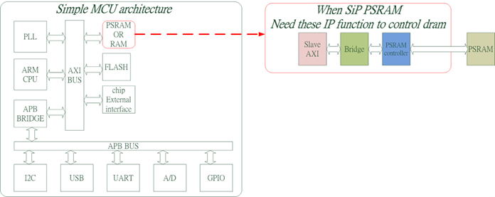
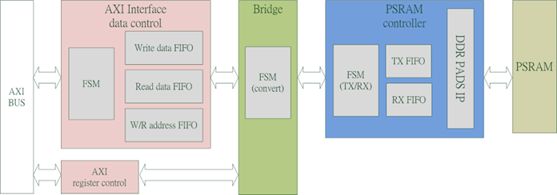

# AXI-Xccela
Usually, the MCU controls the PSRAM controller through the "AXI BUS" protocol, and the IP as shown in the following figure (Slave AXI + Bridge + PSRAM controller ) for reference.

  

## IP features introduction
This IP (Slave AXI + Bridge + PSRAM controller) supports the functions listed below:
•	Supports Xccela x8 IO psram protocol.

•	Supports Xccela psram maximum frequency 200 MHz

•	Supports Xccela psram mode register write and read, MR0~MR8.

•	Supports Xccela psram array write and read.
•	Supports AXI4 maximum frequency 250 MHz
•	Supports AXI4 data width of 16/32-bit
•	Supports AXI4 address width of 32-bit
•	Supports AXI4 INCR burst length of 256.
•	Supports AXI4 Narrow Transaction.

## IP block diagram
The following diagram uses a detailed block diagram to illustrate the functionality required for each block.

  

 
